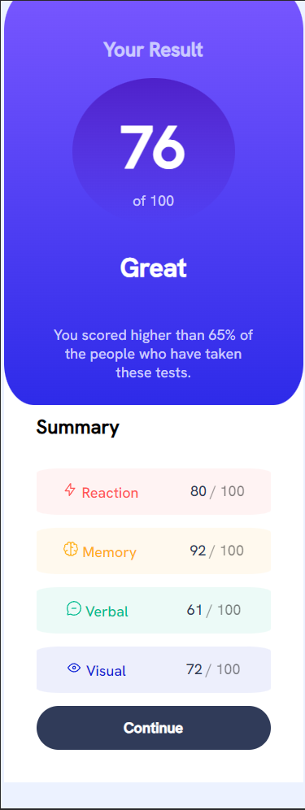
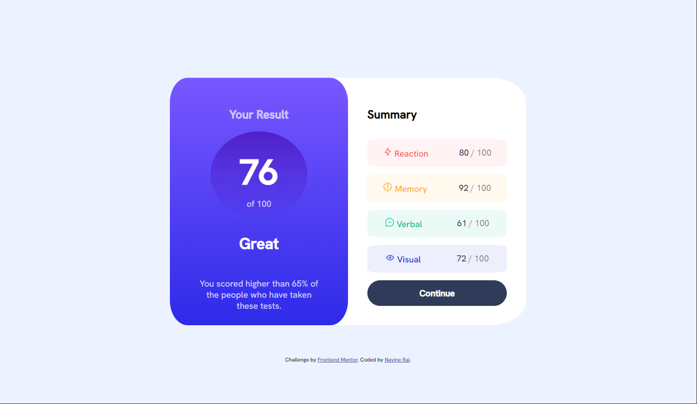

# Frontend Mentor - Results summary component solution

This is a solution to the [Results summary component challenge on Frontend Mentor](https://www.frontendmentor.io/challenges/results-summary-component-CE_K6s0maV). Frontend Mentor challenges help you improve your coding skills by building realistic projects. 

## Table of contents

- [Overview](#overview)
  - [The challenge](#the-challenge)
  - [Screenshot](#screenshot)
  - [Links](#links)
- [My process](#my-process)
  - [Built with](#built-with)
  - [What I learned](#what-i-learned)
  - [Continued development](#continued-development)
  - [Useful resources](#useful-resources)
- [Author](#author)

## Overview

### The challenge

Users should be able to:

- View the optimal layout for the interface depending on their device's screen size
- See hover and focus states for all interactive elements on the page
- **Bonus**: Use the local JSON data to dynamically populate the content

### Screenshot

### Links

- Solution URL: [Add solution URL here](https://your-solution-url.com)
- Live Site URL: [Add live site URL here](https://your-live-site-url.com)

## My process

### Built with

- Semantic HTML5 markup
- Flexbox
- CSS Grid
- CSS gradients

### What I learned

Some new concepts I learned in making this project were the use of css gradients, the hsl function vs the hsla function, setting up and manipulating a css grid, as well as the use of grid and flexbox together.

### Continued development

For continued development, I would like to add the functionality of the webpage to parse and use the data included in the json file to dynamically update the data on the results and summary screen. I'm likely to go back and add that functionality as I learn javascript.

### Useful resources

- [CSS Tricks - fr unit](https://css-tricks.com/introduction-fr-css-unit/) - This helped me understand the use and purpose of css's fr unit.
- [CSS Tricks - grid guide](https://css-tricks.com/snippets/css/complete-guide-grid/) - This section on the css grid helped me to understand how to set it up, as well as which properties apply to the parent and which apply to the child.

## Author

- Website - [Navine Rai](https://github.com/rainSax)
- Frontend Mentor - [@rainSax](https://www.frontendmentor.io/profile/rainSax)
